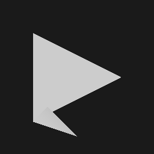

## 总结
难点在于：
1. 变换矩阵，
    * 变换矩阵实际上表示的是先旋转后平移，最好是分别写出R，T，然后再应用矩阵乘法；或是例如pytorch3d手动计算变换之后的平移矩阵
    * 坐标值，对于每个矩阵的求解需要完全理解。例如，在求解透视投影的变换矩阵的时候，如果z_near, z_far表示距离相机的距离的话，则变换实际上是(x, y, -z_near, 1) -> (-z_near* x, -z_near * y, z_near^2, -z_near)，而课程中讲解的是(x, y, n, 1)->(nx, ny, n^2, n), 即没有区分n表示坐标还是距离
2. 齐次坐标
    * 注意透视投影变换之后，需要除以最后一个分量，化为标准的齐次坐标. 假设投影的真实目标点事(x, y, z, 1)，则透视投影计算的结果实际上是(zx, zy, z**2, z)。
    * 透视投影的坐标变换包含两步，一步是从frustum到cube，然后是正交投影，正交投影这里涉及到平移到以原点为中心，然后进行缩放。这里考虑的一个问题是是否需要在第二步的时候对齐次坐标进行标准化，实际上不需要，因为平移量也会被坐标的最后一个分量放大
3. 矩阵操作
    * 一系列的gather、index_add操作。这部分还没有完全检查完毕
4. 重心坐标的计算
    * 使用叉乘计算三角形的面积，实际上计算的是面积的两倍，并且，不同的叉乘顺序得到的值正负号不同，需要考虑
5. 光栅化
    * 实现上有两重循环，计算很慢，很复杂
    * 计算每个三角形的覆盖区域的时候，如果boundary计算不合理，容易产生孔洞
6. lighting和texturing
    * texturing不涉及到normal的计算，因此计算的结果可视化出来可能没有深度差异
    * lighting涉及到normal的计算，因此应该会给texturing的结果加上明亮的差异
    * 注意lighting的方向定义，normal一般定义成从shading point出发的，因此lighting一般也最好定义成shading point出发
7. 过程比较繁琐，并且很难设置测试数据
        
测试情况
* texturing

            
    两张图片展示了像素的uv坐标图，插值的结果还是很连续的
        
* lighting

            
    三角形的朝向不同，可以看出明暗程度有一定差异

* mesh rendering  

texturing

            
output = texturing * shading

